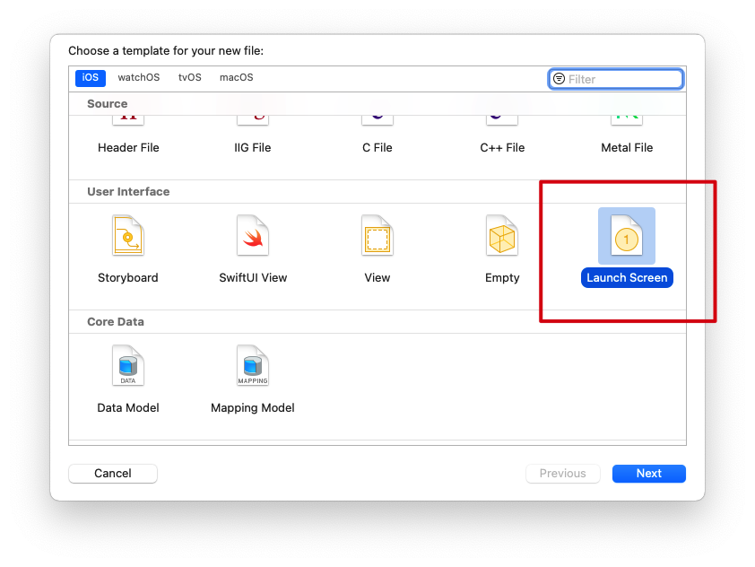
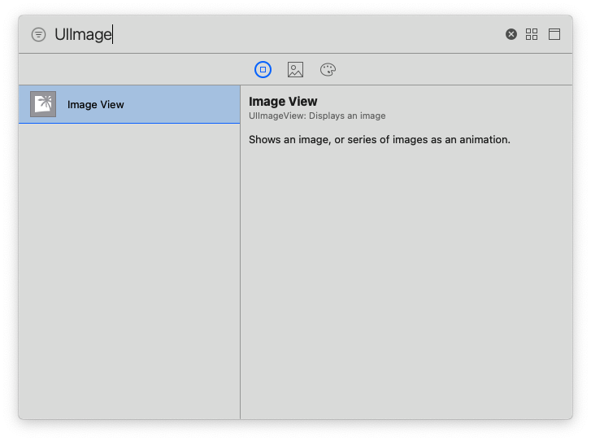
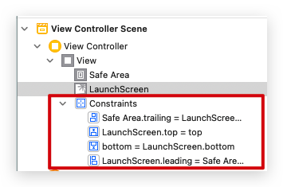
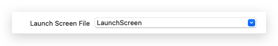

# 使用LaunchScreen.storyboard作为APP启动页

### 1. 打开LaunchScreen.storyboard文件



### 2. 在storyboard中添加UIImageView控件



### 3. 设置UIImageView约束

- 设置四周边距都为0

再适配safe area，选择View的Constraints并设置如下内容：

- bottom的Vertical Space Constraint的First Item设置为superview
- top的Vertical Space Constraint的Second Item设置为superview



### 4. 设置Assets.xcassets

新建一个Image Set，然后在finder中打开对应的Contents.json文件，并修改为如下内容：

```json
{
  "images" : [
    {
      "idiom" : "iphone",
      "scale" : "1x"
    },
    {
      "idiom" : "iphone",
      "scale" : "2x"
    },
    {
      "idiom" : "iphone",
      "scale" : "3x"
    },
    {
      "idiom" : "iphone",
      "scale" : "1x",
      "subtype" : "retina4"
    },
    {
      "idiom" : "iphone",
      "scale" : "2x",
      "subtype" : "retina4"
    },
    {
      "idiom" : "iphone",
      "scale" : "3x",
      "subtype" : "retina4"
    },
    {
      "idiom" : "iphone",
      "scale" : "3x",
      "subtype" : "736h"
    },
    {
      "idiom" : "iphone",
      "scale" : "2x",
      "subtype" : "667h"
    },
    {
      "idiom" : "iphone",
      "scale" : "3x",
      "subtype" : "2436h"
    },
    {
      "idiom" : "iphone",
      "scale" : "3x",
      "subtype" : "2688h"
    },
    {
      "idiom" : "iphone",
      "scale" : "2x",
      "subtype" : "1792h"
    }
  ],
  "info" : {
    "author" : "xcode",
    "version" : 1
  }
}
```

保存文件后，在Xcode的Assets.xcassets里将对应尺寸的图片拖入Image Set

### 5. 设置storyboard图片源

在storyboard的UIImageView里设置图片源为刚刚在Assets.xcassets中添加的Image Set

### 6. 设置启动页

在项目 -> TARGETS -> General -> App Icons and Launch Images -> Launch Screen File选择刚刚设置的LaunchScreen

