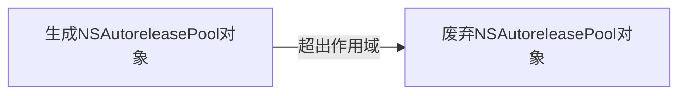

# Objective-C内存管理：对象

### 对象生成与持有

使用以下开头的方法生成对象时，自己生成，自己直接持有

- alloc
- new
- copy
- mutableCopy

```objective-c
id object = [[NSObject alloc] init];
/*
 * 自己生成并持有对象
 */
```

使用类方法生成对象，**非自己生成**，自己可以持有，如下：

```objective-c
id object = [NSMutableArray array];
/*
 * 取得对象但自己不持有
 * 对象非自己生成
 */

[object retain];
/*
 * 自己持有对象
 */
```


### release与autorelease

release

```objective-c
id object = [NSMutableArray array];
/*
 * 使用类方法，取得得对象存在但自己不retain对象
 */

[object retain];
/*
 * 自己持有对象
 */

[object release];
/*
 * 释放对象，对象不可再被访问
 */
```

autorelease

```objective-c
id object = [[NSObject alloc] init];
/*
 * 使用alloc方法，自己retain对象
 */

[object autorelease];
/*
 * 对象仍然存在，但自己不持有对象，对象被注册到autoreleasepool中
 * pool结束时会自动调用release
 */
```

当对象超出其作用域（作用域可人为设置）时，对象的release方法会被调用



在源码中：

```objective-c
NSAutoreleasePool *pool = [[NSAutoreleasePool alloc] init];

id object = [[NSObject alloc] init];
[object autorelease];

/*
 * 超出作用域后
 */
[pool drain]; // 等同于[object release];
```

Cocoa中很多类方法自带autorelease，如：`NSMutableArray`的`arrayWithCapacity`方法
